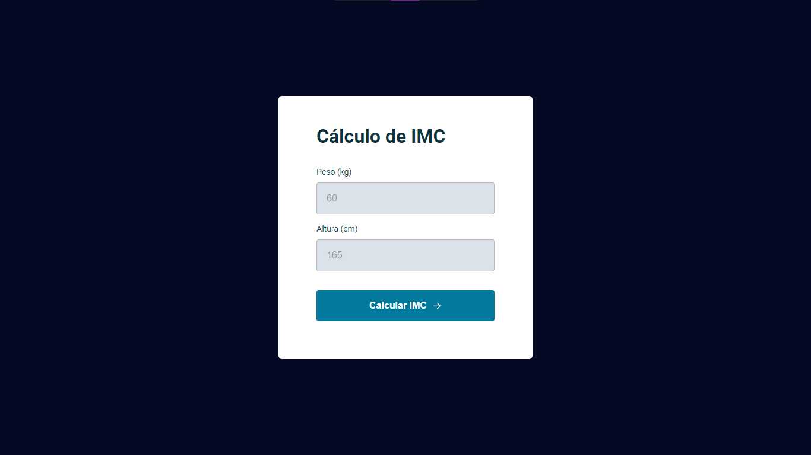

<h1 align="center">
Projeto IMC
</h1>

  

## Tecnologias

Esse projeto foi desenvolvido com as seguintes tecnologias:

- JavaScript

## 💻 Projeto

O Projeto IMC é um projeto que visa calcular o Indicie de Massa Corporal do usuário com o Peso(kg) e Altura(cm).

## 🔖 Layout

Você pode baixar o layout do projeto no formato `.sketch` através [desse link](.github/DevRadar.sketch).

Para abrir o arquivo no formato `.sketch` em qualquer sistema operacional utilize a ferramenta [Figma](https://figma.com).

## 🤔 Como contribuir

- Faça um fork desse repositório;
- Cria uma branch com a sua feature: `git checkout -b minha-feature`;
- Faça commit das suas alterações: `git commit -m 'feat: Minha nova feature'`;
- Faça push para a sua branch: `git push origin minha-feature`.

Depois que o merge da sua pull request for feito, você pode deletar a sua branch.

## Licença

Esse projeto está sob a licença MIT. Veja o arquivo [LICENSE](LICENSE.md) para mais detalhes.

